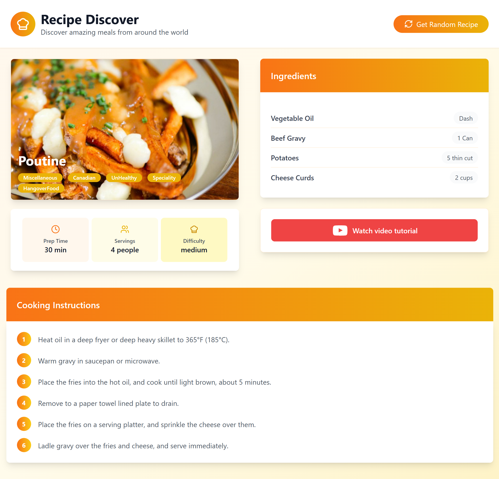

# 🍳 Recipe Discover

An interactive recipe web application built with React and styled using Tailwind CSS.  
Users can explore meals from around the world, view detailed ingredients, cooking instructions, and watch related YouTube videos.

---

## 🔍 Preview



---

## 🚀 Features

- Discover random recipes with a single click  
- View meal details including title, category, area, and tags  
- Explore ingredients with a clean card layout  
- Step-by-step cooking instructions  
- Watch related YouTube videos for each recipe  
- Responsive and visually appealing UI using Tailwind CSS  
- Smooth animations and gradient accents for a modern look  

---

## 🧠 Technologies Used

- React (Functional Components & Hooks)  
- Tailwind CSS  
- JavaScript (ES6+)  
- Flowbite React Icons for UI elements  

---

## 🧩 How It Works

1. Click **Get Random Recipe** to fetch a new meal.  
2. Meal details appear including:  
   - Title, category, area, and tags  
   - Ingredients with quantity and name  
   - Step-by-step cooking instructions  
   - Embedded YouTube video for the recipe  
3. Explore multiple recipes by clicking the button again for a new random recipe.  

---

## ⚙️ Installation & Usage

### Clone the Repository
```bash
git clone https://github.com/Yasin-Rahimi/RecipeDiscover.git
cd RecipeDiscover
