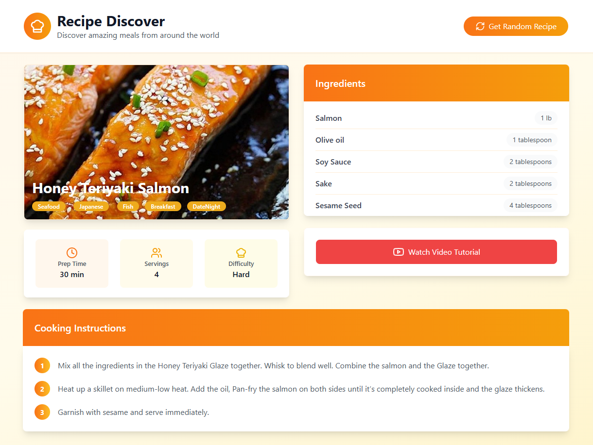

# 🍽️ Recipe Discover

A **simple single-page web application** that displays a **random recipe** using data from [TheMealDB API](https://www.themealdb.com/api.php).  
Built with **HTML**, **CSS (Tailwind)**, and **JavaScript** using **Axios** for API requests.

---
<p align="center">
  
</p>

## 🚀 Features

- Fetches random recipes dynamically using **Axios**.  
- Displays meal information including:
  - **Image**, **category**, **origin**, and **tags**.  
  - **Ingredients** and **measurements**.  
  - **Step-by-step cooking instructions**.  
  - **YouTube tutorial** for each meal.  
- Clean and responsive UI with **Tailwind CSS**.  
- Easy to use — just click **“Get Random Recipe”** to load a new one instantly.

---

## 🧠 Technologies Used

- **HTML5**
- **CSS3**
- **JavaScript (ES6+)**
- **Axios** for API requests
- **Lucide Icons**

---

## 🧩 API Information

All data is fetched from **TheMealDB API**:  
> `https://www.themealdb.com/api/json/v1/1/random.php`

This API returns JSON data for one random meal each time it’s called.  
The app extracts:
- `strMeal` (name)  
- `strCategory`, `strArea`  
- `strInstructions`  
- `strTags`, `strYoutube`  
- Ingredients and measurements (`strIngredient1...20`, `strMeasure1...20`)

---

## 🧭 How It Works

1. The app calls **TheMealDB API** using Axios.  
2. Data is **formatted** into a clean JavaScript object.  
3. The information is **rendered dynamically** into the HTML:
   - The meal image is set as a **background**.  
   - Ingredients and steps are displayed with proper styling.  
4. Clicking **“Get Random Recipe”** triggers a new API request.

---

## ◻ Example Output

When you click the **Get Random Recipe** button, the app might display something like:

- **Meal:** Chicken Alfredo Pasta  
- **Category:** Pasta  
- **Origin:** Italian  
- **Ingredients:** Chicken breast, cream, parmesan, pasta, etc.  
- **Instructions:** Step-by-step guide to cook the meal.  
- **Watch Video:** Opens the YouTube tutorial.

---

## ⚙️ Installation & Usage

1. Clone the repository:  
   ```
   git clone https://github.com/your-username/recipe-discover.git
